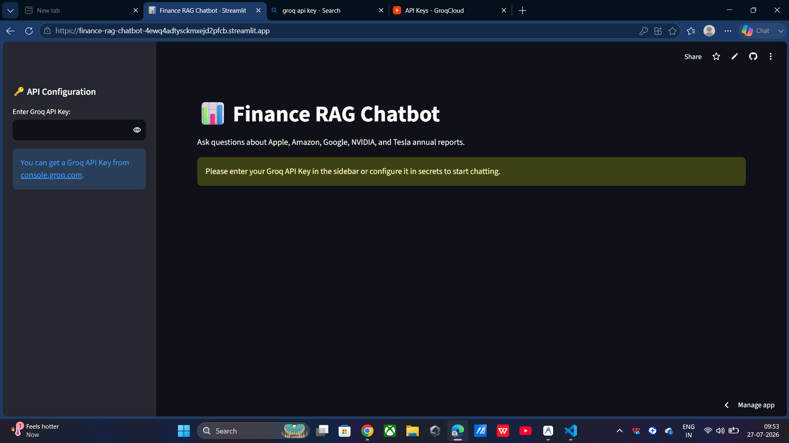
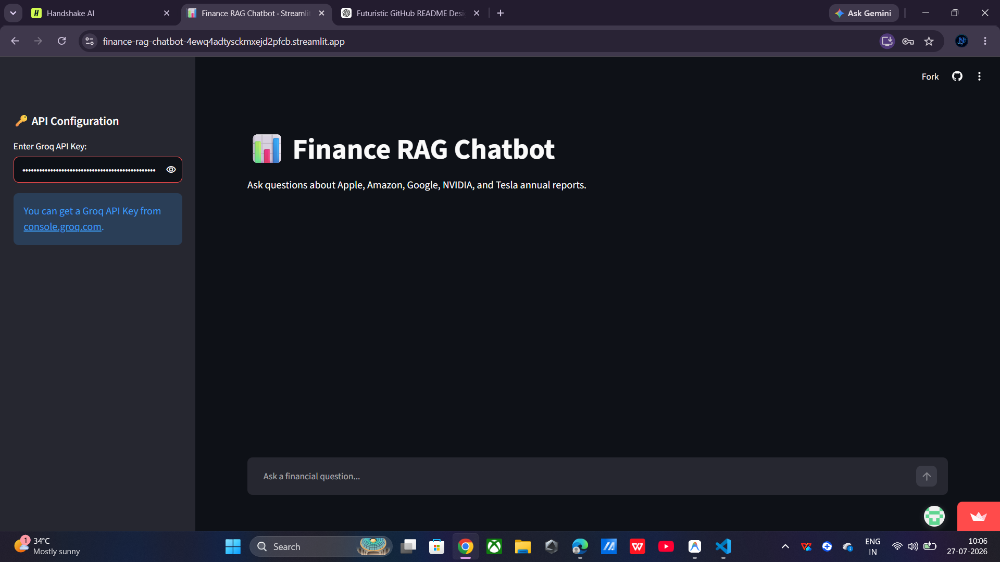
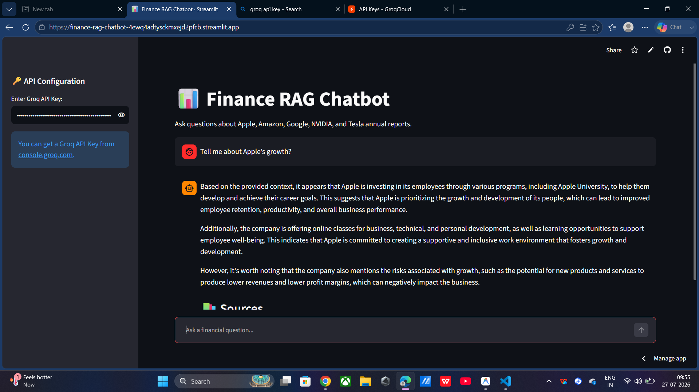
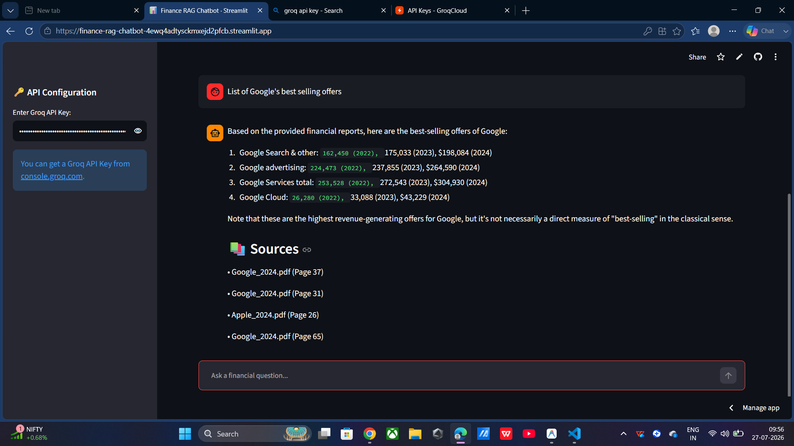

<div align="center">

# 🌌 Finance RAG Chatbot
### *AI-Powered Financial Intelligence using Retrieval-Augmented Generation*

<p align="center">

</p>

<p align="center">


</p>

---

## 🚀 Overview

Finance RAG Chatbot is an AI-powered financial assistant that combines **Retrieval-Augmented Generation (RAG)** with **Large Language Models** to answer financial questions using **official annual reports** instead of relying only on pretrained model knowledge.

The application indexes company reports into a semantic vector database and retrieves the most relevant information before generating responses. This approach significantly improves factual accuracy, reduces hallucinations, and provides transparent answers with document citations.

Currently, the chatbot supports annual reports from:

- 🍎 Apple
- 📦 Amazon
- 🌐 Google
- 💚 NVIDIA
- 🚗 Tesla

---

# ✨ Features

- 🧠 Retrieval-Augmented Generation (RAG)
- 📚 Semantic search using FAISS
- ⚡ Ultra-fast inference with Groq Cloud
- 🤖 Llama-3.1-8B-Instant
- 📄 Source citations with page numbers
- 💬 Natural language financial Q&A
- 🌙 Modern Streamlit interface
- 🔍 Context-aware document retrieval
- 📈 Enterprise-grade financial document search

---

# 🏗 Architecture

```text
                User Question
                      │
                      ▼
            Sentence Embeddings
                      │
                      ▼
              FAISS Vector Search
                      │
                      ▼
        Relevant Financial Chunks
                      │
                      ▼
          Llama-3.1 (Groq Cloud)
                      │
                      ▼
     Accurate Financial Response
            + Source Citations
```

---

# ⚙ Tech Stack

| Technology | Purpose |
|------------|---------|
| Python | Backend |
| Streamlit | Web Application |
| LangChain | RAG Pipeline |
| FAISS | Vector Database |
| HuggingFace Embeddings | Text Embeddings |
| Groq Cloud | LLM Inference |
| Llama-3.1-8B-Instant | Language Model |

---

# 📂 Project Structure

```
Finance-RAG-Chatbot/
│
├── app.py
├── requirements.txt
├── Data/
│   ├── Apple.pdf
│   ├── Amazon.pdf
│   ├── Google.pdf
│   ├── NVIDIA.pdf
│   └── Tesla.pdf
├── vectorstore/
├── .env.example
└── README.md
```

---

# 🚀 Installation

Clone the repository

```bash
git clone https://github.com/NUPUR32/Finance-RAG-Chatbot.git

cd Finance-RAG-Chatbot
```

Install dependencies

```bash
pip install -r requirements.txt
```

Create a `.env`

```env
GROQ_API_KEY=your_api_key_here
```

Run the application

```bash
streamlit run app.py
```

---

# 💬 Example Questions

- Compare Apple's revenue growth over the past year.
- What are Tesla's major business risks?
- How much did NVIDIA spend on R&D?
- Summarize Amazon's operating income.
- What are Google's biggest revenue segments?
- Which company has the highest gross margin?
- Explain Apple's cash flow performance.
- What risks are highlighted in Tesla's annual report?

---

# 📊 Why RAG?

| Traditional Chatbot | Finance RAG Chatbot |
|---------------------|--------------------|
| Generic responses | Grounded answers |
| Hallucinations | Evidence-backed |
| No references | Source citations |
| Static knowledge | Annual report retrieval |
| Less reliable | High factual accuracy |

---

# 🌍 Live Demo

🚀 **Streamlit Cloud**

https://finance-rag-chatbot-4ewq4adtysckmxejd2pfcb.streamlit.app

---

# 📸 Screenshots

## 🏠 Home Page

<p align="center">
  
</p>

---

## 💬 Chat Interface

<p align="center">
  
</p>

---

## 🤖 AI Response

<p align="center">
  
</p>

---

## 📚 Source Citations

<p align="center">
  
</p>

---

# 🔮 Future Roadmap

- 📈 Real-time stock market integration
- 📰 Financial news retrieval
- 📊 Interactive charts
- 📉 Portfolio analytics
- 📑 SEC filing support
- 🌐 Multi-company comparison
- 🤖 Multi-agent financial assistant
- 🎤 Voice interaction
- ☁ Cloud deployment
- 📱 Mobile-friendly interface

---

# 🤝 Contributing

Contributions are welcome.

1. Fork the repository
2. Create a feature branch
3. Commit your changes
4. Push the branch
5. Open a Pull Request

---

# 📜 License

Licensed under the **MIT License**.

---

<div align="center">

### ⭐ If you found this project helpful, consider giving it a Star!

**Made with ❤️ using Streamlit, LangChain, FAISS, Groq, and Llama 3.1**

</div>
